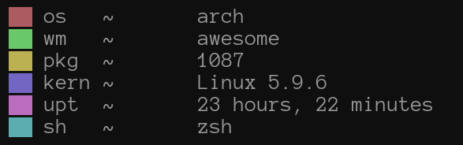

## Yet another fetch ...

<p align="center">

</p>

### Installation

#### Use it without installing

``` sh
curl -s https://raw.githubusercontent.com/yrwq/yafetch/main/yafetch | sh
```

#### Use it locally

``` sh
git clone https://github.com/yrwq/yafetch && cd yafetch

chmod +x yafetch

cp yafetch ~/.local/bin/

yafetch
```

### Currently supported distrobutions

- Arch
- Artix
- Debian
- Void
