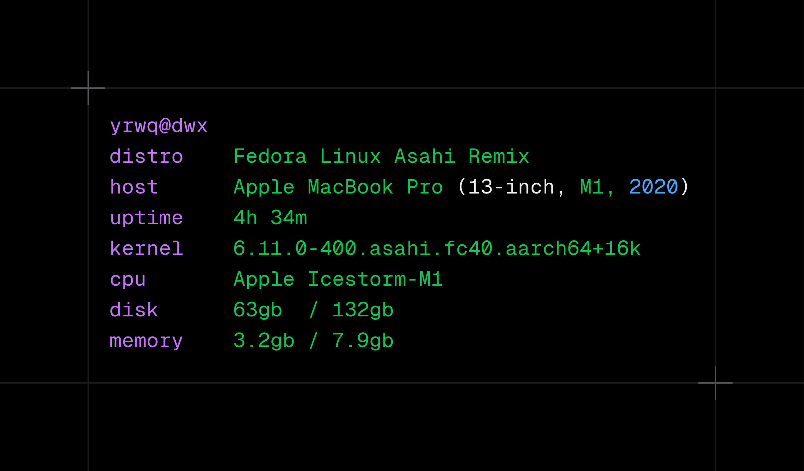

<span align="center">
  
</span>

<h4 align="center">Yafetch is a minimal command line system information tool written in Rust and configured in Lua. </h4>

## installation

```bash
git clone https://github.com/yrwq/yafetch && cd yafetch
cargo build --release
sudo cp target/release/yafetch /usr/bin
mkdir -p ~/.config/yafetch
cp examples/sample.lua ~/.config/yafetch/init.lua
```

## usage

run `yafetch`

yafetch is extensible in lua, the default location for the configuration file is `~/.config/yafetch/init.lua`.

## configuration
